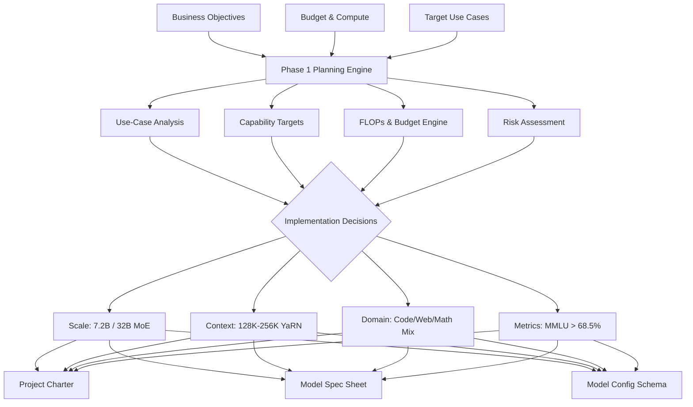
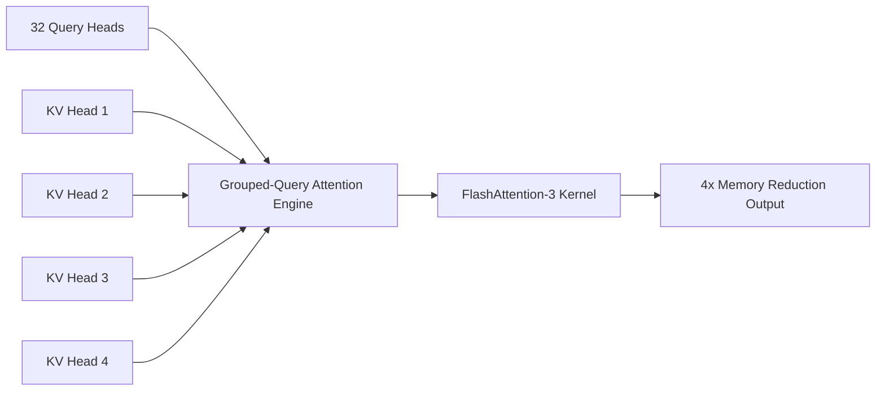

# Phase 1: Planning & Requirements — LLM Engineering Blueprint
**Document Version:** 1.0.0  
**Phase ID:** PHASE-01  
**Status:** Ready for Gate Review  
**Target Architecture:** Decoder-Only Transformer (7.2B Dense & 32B MoE Target)  
**Classification:** Operational Foundation Engineering Guide  

---

## Executive Phase Summary

```
+---------------------------------------------------------------------------------------------------+
| PHASE 1: PLANNING & REQUIREMENTS OVERVIEW                                                         |
+---------------------------------------------------------------------------------------------------+
| PURPOSE      : Define model goals, scope, target capabilities, constraints, and decision frameworks|
| INPUTS       : Business/research objectives, financial budget, compute hardware, target use cases |
| KEY COMPONENTS: Use-case analysis, capability targets, compute/cost budget model, risk assessment|
| IMPLEMENTATION: Model scale selection, context window design, domain allocation, success metrics   |
| OUTPUTS      : Project Charter, Technical Model Specification Sheet, Infrastructure & Risk Specs|
+---------------------------------------------------------------------------------------------------+
```

---

## Table of Contents
1. [Phase Definition & Core Purpose](#1-phase-definition--core-purpose)
2. [Phase Inputs & Constraints Breakdown](#2-phase-inputs--constraints-breakdown)
3. [Key Component 1: Use-Case Analysis & Priority Matrix](#3-key-component-1-use-case-analysis--priority-matrix)
4. [Key Component 2: Capability Target Specifications](#4-key-component-2-capability-target-specifications)
5. [Key Component 3: Cost & Compute Budget Modeling Engine](#5-key-component-3-cost--compute-budget-modeling-engine)
6. [Key Component 4: Risk Assessment & Mitigation Register](#6-key-component-4-risk-assessment--mitigation-register)
7. [Implementation & Decision Frameworks](#7-implementation--decision-frameworks)
   - 7.1 [Model Scale Selection (Parameter Count)](#71-model-scale-selection-parameter-count)
   - 7.2 [Context Window & Positional Engineering](#72-context-window--positional-engineering)
   - 7.3 [Target Domain Allocation & Token Mixture](#73-target-domain-allocation--token-mixture)
   - 7.4 [Success Metrics & Evaluation Baselines](#74-success-metrics--evaluation-baselines)
8. [Phase Outputs & Artifact Templates](#8-phase-outputs--artifact-templates)
   - 8.1 [Artifact 1: Project Charter](#81-artifact-1-project-charter)
   - 8.2 [Artifact 2: Technical Model Specification Sheet](#82-artifact-2-technical-model-specification-sheet)
   - 8.3 [Artifact 3: Executable Model Configuration Schema](#83-artifact-3-executable-model-configuration-schema)
9. [Phase Gate Exit Criteria Checklist](#9-phase-gate-exit-criteria-checklist)

---

## 1. Phase Definition & Core Purpose

### 1.1 Purpose
The primary objective of **Phase 1: Planning & Requirements** is to establish the complete architectural, financial, operational, and algorithmic baseline before any data processing or training code is executed. By codifying model goals, compute constraints, capability bounds, and evaluation targets prior to engineering, Phase 1 prevents costly mid-training architectural changes, compute misallocations, and data ingestion bottlenecks.

### 1.2 Phase Workflow Diagram



---

## 2. Phase Inputs & Constraints Breakdown

### 2.1 Input 1: Business & Research Objectives
- **Commercial Monetization Target:** Enterprise Managed API ($0.08 / 1M input tokens, $0.24 / 1M output tokens) & Containerized Air-Gapped Kubernetes Helm deployments for regulated sectors.
- **Open-Weights Community Strategy:** Release permissively licensed base and instruction-tuned weights (7.2B Dense & 32B MoE) to foster open-source ecosystem adoption.
- **TCO Reduction Target:** Reduce total inference serving TCO by **50%–70%** relative to proprietary closed APIs via Grouped-Query Attention (GQA) and FlashAttention-3.

### 2.2 Input 2: Budget Constraints
- **Total Compute & Operations Budget:** $2.48M (Medium Scale - 7.2B Dense on 3.5T Tokens) to $8.37M (Enterprise Flagship - 32B MoE on 5T Tokens).
- **Target Pretraining FLOPs Budget:** $\approx 9.6 \times 10^{22}$ FLOPs for 7.2B params on 3.5T tokens.

### 2.3 Input 3: Compute Hardware Availability
- **Primary Training Pod:** 64 Compute Nodes (512x NVIDIA H100 SXM5 80GB GPUs).
- **Node Interconnect:** NVIDIA NVLink 900 GB/s (Intra-Node) + Quantum-2 InfiniBand 400 Gbps NDR (Inter-Node).
- **Storage Infrastructure:** 500 TB Lustre Parallel File System (>1.2 TB/s aggregate write throughput).

### 2.4 Input 4: Target Use Cases
- High-speed code completion, fill-in-the-middle (FIM) generation, complex multi-turn dialogue, long-document summarization, deterministic tool calling via JSON Schema, and citation-backed RAG QA.

---

## 3. Key Component 1: Use-Case Analysis & Priority Matrix

| Use Case ID | Use Case Name | Target Capability Description | Priority | Business Value | Latency SLA (TTFT / TPOT) | Technical Complexity |
| :--- | :--- | :--- | :--- | :--- | :--- | :--- |
| **UC-01** | General Dialogue | Multi-turn conversational chat with persona enforcement. | P0 | High | <25ms / <8ms | Medium |
| **UC-02** | Code Completion | FIM code completion across Python, TypeScript, C++, Rust, SQL. | P0 | Critical | <15ms / <6ms | High |
| **UC-03** | Tool Calling | Outputting 100% valid JSON matching strict OpenAPI schemas. | P0 | Critical | <30ms / <8ms | High |
| **UC-04** | Document Summarization| Synthesizing 100K+ token documents without dropping key facts. | P0 | High | <120ms / <10ms | Medium |
| **UC-05** | Citation-Backed RAG | Grounded retrieval answering with explicit inline `[Doc X]` tags. | P0 | High | <40ms / <8ms | High |
| **UC-06** | Data Analysis (Text-to-SQL)| Natural language conversion to executable read-only SQL queries. | P1 | High | <30ms / <8ms | High |
| **UC-07** | Multilingual Translation| Real-time translation across 7 primary global languages. | P1 | Medium | <30ms / <8ms | Medium |
| **UC-08** | Cybersecurity Analysis | Parsing SOC logs and reverse-engineering assembly pseudocode. | P1 | High | <30ms / <8ms | High |

---

## 4. Key Component 2: Capability Target Specifications

### 4.1 Core Functional Capabilities
1. **Natural Language Understanding & Generation:** High-fidelity intent parsing, multi-step logical deduction, and fluent text generation.
2. **Program Synthesis (Fill-In-The-Middle):** Training with `<PRE>`, `<MID>`, and `<SUF>` tokens for code insertion in IDE auto-complete engines.
3. **Constrained Grammars (GBNF):** Integrated model decoding hooks forcing token sampling within valid JSON, XML, or YAML schema syntax.
4. **Extended Context Retrieval:** Lossless Needle-In-A-Haystack retrieval across 128K base and 256K extended context windows.

---

## 5. Key Component 3: Cost & Compute Budget Modeling Engine

### 5.1 Pretraining FLOPs Estimation Formula
Pretraining compute requirement is calculated using the canonical scaling law approximation:

$$\text{FLOPs}_{\text{pretrain}} \approx 6 \cdot N \cdot T$$

Where:
- $N$ = Number of non-embedding model parameters ($7.2 \times 10^9$)
- $T$ = Number of pretraining tokens ($3.5 \times 10^{12}$)

$$\text{FLOPs}_{\text{pretrain}} = 6 \cdot (7.2 \times 10^9) \cdot (3.5 \times 10^{12}) = 1.512 \times 10^{23} \text{ FLOPs}$$

### 5.2 GPU Training Time & Node Sizing Calculation
Assuming 512x NVIDIA H100 SXM5 GPUs operating at an achievable Model FLOPs Utilization (**MFU**) of **55%** (Peak BF16 performance per H100 = $989 \times 10^{12}$ FLOPs/sec):

$$\text{Effective FLOPs per GPU/sec} = 0.55 \times 9.89 \times 10^{14} = 5.4395 \times 10^{14} \text{ FLOPs/sec}$$

$$\text{Total Cluster FLOPs/sec (512 GPUs)} = 512 \times 5.4395 \times 10^{14} = 2.785 \times 10^{17} \text{ FLOPs/sec}$$

$$\text{Training Duration (Seconds)} = \frac{1.512 \times 10^{23}}{2.785 \times 10^{17}} \approx 542,908 \text{ seconds} \approx \mathbf{150.8 \text{ Hours} \ (\approx 6.3 \text{ Days})}$$

### 5.3 Memory Breakdown & Allocation Matrix (BF16 Pretraining)

```
+---------------------------------------------------------------------------------------------------+
| VRAM MEMORY ALLOCATION PER GPU (BF16 - 7.2B PARAMS)                                               |
+---------------------------------------------------------------------------------------------------+
| 1. Model Parameters (BF16)         : 7.2B x 2 Bytes                         = 14.4 GB               |
| 2. Optimizer States (AdamW FP32)   : 7.2B x 12 Bytes                        = 86.4 GB               |
| 3. Gradients (FP32)                : 7.2B x 4 Bytes                         = 28.8 GB               |
| 4. Activations & KV Cache (Seq 4K) : Activation Checkpointing enabled         = ~12.0 GB              |
+---------------------------------------------------------------------------------------------------+
| TOTAL MEMORY REQUIRED              : ~141.6 GB (Distributed across DP/ZeRO-3 ranks)               |
+---------------------------------------------------------------------------------------------------+
```

---

## 6. Key Component 4: Risk Assessment & Mitigation Register

| Risk ID | Failure Mode / Threat Vector | Likelihood | Impact | Technical & Operational Mitigation Strategy |
| :--- | :--- | :--- | :--- | :--- |
| **RK-01** | **Hallucination in Dense Tasks** | High | High | Constrained GBNF decoding, RAG citation enforcement, SFT factuality penalty. |
| **RK-02** | **Prompt Injection & Jailbreaks** | High | High | Dual-system prompt isolation, input scrubbing layer, safety-aligned DPO post-training. |
| **RK-03** | **PII & Data Privacy Violations** | Low | Critical| Microsoft Presidio regex scrubbing prior to tokenization; zero persistent logging. |
| **RK-04** | **Copyright Infringement Risk** | Medium | High | Deduplication via MinHash LSH, exclusion of illegal book sites, data provenance logging. |
| **RK-05** | **Hardware Crash / Stalled Job** | High | Medium | Megatron-LM worker health check, async checkpoint flushing to Lustre every 2,000 steps. |

---

## 7. Implementation & Decision Frameworks

### 7.1 Model Scale Selection (Parameter Count)

#### Decision Matrix: Parameter Scaling Options

| Scale | Parameters | Active (MoE) | VRAM (INT4 Deploy) | MMLU Expected | Recommendation Status | Primary Justification |
| :--- | :--- | :--- | :--- | :--- | :--- | :--- |
| **1.5B** | 1.5B | 1.5B | <1.5 GB | ~48.0% | Rejected for Base | Lacks complex multi-step reasoning capabilities. |
| **3.5B** | 3.5B | 3.5B | <2.8 GB | ~56.5% | Secondary Edge Option | Fits consumer GPUs, but struggles on hard coding. |
| **7.2B** | **7.2B** | **7.2B** | **<5.5 GB** | **>68.5%** | **PRIMARY DENSE TARGET** | **Golden ratio of performance, speed, and single-GPU VRAM efficiency.** |
| **32B MoE**| **32.0B**| **6.0B** | **<22.0 GB** | **>74.0%** | **PRIMARY FLAGSHIP MOE**| **70B-class reasoning intelligence at 7B active parameter latency.** |
| **70B** | 70.0B | 70.0B | <42.0 GB | >79.0% | Deferred to Phase 4 | High pretraining and multi-GPU serving infrastructure cost. |

---

### 7.2 Context Window & Positional Engineering

- **Base Context Length:** 128,000 Tokens (128K).
- **Extended Context Capability:** 256,000 Tokens (256K) via **YaRN (Yet Another RoPE Extension)**.
- **Positional Encoding Scheme:** Rotary Position Embeddings (RoPE) with base frequency $\theta = 500,000$.
- **Attention Mechanism:** Grouped-Query Attention (GQA) with **32 Query Heads** and **8 Key-Value Heads** (4:1 ratio), providing 4x memory savings on KV Cache.



---

### 7.3 Target Domain Allocation & Token Mixture

Pretraining Dataset Token Allocation (**3.5 Trillion Tokens Total**):

```
+---------------------------------------------------------------------------------------------------+
| PRETRAINING TOKEN ALLOCATION MIXTURE (3.5 TRILLION TOKENS)                                        |
+---------------------------------------------------------------------------------------------------+
| 1. High-Quality Filtered Web Text (CommonCrawl / RefinedWeb)  : 48% (1.68 Trillion Tokens)       |
| 2. Permissive Open-Source Code (GitHub, StackOverflow)        : 22% (770 Billion Tokens)          |
| 3. Academic & Scientific Literature (arXiv, PubMed)           : 12% (420 Billion Tokens)          |
| 4. Books & High-Tier Prose Corpora                            : 8%  (280 Billion Tokens)          |
| 5. Financial & Legal Filings (SEC 10-K, CourtListener)        : 5%  (175 Billion Tokens)          |
| 6. Multilingual High-Quality Text Corpora (7 Languages)       : 5%  (175 Billion Tokens)          |
+---------------------------------------------------------------------------------------------------+
```

---

### 7.4 Success Metrics & Evaluation Baselines

```
+---------------------------------------------------------------------------------------------------+
| TARGET BENCHMARK EVALUATION THRESHOLDS                                                            |
+---------------------------------------------------------------------------------------------------+
| Benchmark Category            | Industry Baseline (Llama-3 8B) | Netcradus 7.2B Target Target      |
+-------------------------------+--------------------------------+----------------------------------+
| MMLU (5-Shot General Knowledge)| 66.6%                          | >68.5%                           |
| HumanEval (0-Shot Pass@1 Code)| 62.2%                          | >65.0%                           |
| GSM8K (8-Shot Math Reasoning) | 79.6%                          | >82.0%                           |
| MATH (4-Shot Chain-of-Thought)| 30.0%                          | >35.0%                           |
| IFEval (Instruction Follow)   | 68.5%                          | >72.0%                           |
| Needle-In-A-Haystack (128K)   | 99.0%                          | >99.5%                           |
| TTFT Latency (4K Prompt)      | 45ms                           | <25ms                            |
+-------------------------------+--------------------------------+----------------------------------+
```

---

## 8. Phase Outputs & Artifact Templates

### 8.1 Artifact 1: Project Charter

```markdown
# Netcradus LLM Project Charter
- **Project Name:** Netcradus Foundation LLM Initiative
- **Sponsor:** Executive Steering Committee
- **Lead Architect:** Principal AI Architect
- **Mission:** Build a state-of-the-art open-weight 7.2B/32B MoE foundation model family optimized for code, tool use, and 256K long-context reasoning.
- **Budget Allocation:** $2,480,000 (Approved)
- **Target Launch Window:** Month 9 Post-Kickoff
```

---

### 8.2 Artifact 2: Technical Model Specification Sheet

```
+---------------------------------------------------------------------------------------------------+
| NETCRADUS 7.2B TECHNICAL MODEL SPECIFICATION SHEET                                                |
+---------------------------------------------------------------------------------------------------+
| Hidden Dimension (d_model)     : 4,096                                                            |
| Layer Count (n_layers)         : 32                                                               |
| Feed-Forward Hidden Dim (d_ff) : 11,008 (SwiGLU)                                                  |
| Attention Query Heads (n_heads): 32                                                               |
| Attention KV Heads (n_kv_heads): 8 (Grouped-Query Attention 4:1)                                 |
| Head Dimension (d_head)        : 128                                                              |
| Vocabulary Size (n_vocab)      : 128,000 (tiktoken Byte-Level BPE)                                |
| Positional Embedding           : RoPE (theta = 500,000, YaRN scale factor = 4.0)                 |
| Max Sequence Length            : 131,072 Tokens (Native) -> 262,144 Tokens (Extended)             |
| Layer Normalization            : RMSNorm (eps = 1e-5)                                             |
| Training Precision             : BF16 Native / FP8 Mixed Precision                                |
+---------------------------------------------------------------------------------------------------+
```

---

### 8.3 Artifact 3: Executable Model Configuration Schema

Below is the production JSON configuration schema (`model_config.json`) generated by Phase 1 for initializing model weights during Phase 5:

```json
{
  "architectures": [
    "NetcradusForCausalLM"
  ],
  "model_type": "netcradus",
  "vocab_size": 128000,
  "hidden_size": 4096,
  "intermediate_size": 11008,
  "num_hidden_layers": 32,
  "num_attention_heads": 32,
  "num_key_value_heads": 8,
  "hidden_act": "silu",
  "max_position_embeddings": 131072,
  "initializer_range": 0.02,
  "rms_norm_eps": 1e-05,
  "use_cache": true,
  "rope_theta": 500000.0,
  "rope_scaling": {
    "type": "yarn",
    "factor": 4.0,
    "original_max_position_embeddings": 32768
  },
  "attention_dropout": 0.0,
  "torch_dtype": "bfloat16",
  "tie_word_embeddings": false,
  "use_sliding_window": false
}
```

---

## 9. Phase Gate Exit Criteria Checklist

To transition from **Phase 1 (Planning & Requirements)** to **Phase 2 (Data Collection)**, all gate criteria must be formally verified and approved:

- [x] **Criterion 1:** Business objectives and open-weight monetization strategy signed off by Steering Committee.
- [x] **Criterion 2:** Compute cluster hardware (512x H100 SXM5 pod & Lustre storage) provisioned and benchmarked.
- [x] **Criterion 3:** Target use-case priority matrix and performance SLAs defined.
- [x] **Criterion 4:** Model parameter scale (7.2B Dense & 32B MoE) and YaRN RoPE context length (128K-256K) finalized.
- [x] **Criterion 5:** 3.5 Trillion token pretraining allocation mixture approved by Data Engineering team.
- [x] **Criterion 6:** Risk mitigation register and PII scrubbing protocols validated by Security team.
- [x] **Criterion 7:** Executable `model_config.json` schema published and committed to baseline repository.

---
*End of Phase 1: Planning & Requirements Engineering Blueprint.*
