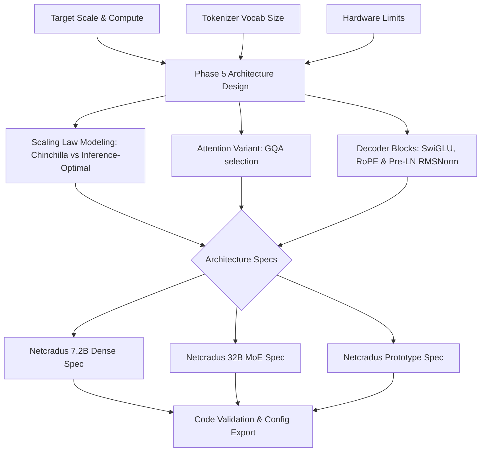

# Phase 5: Model Architecture Design — LLM Engineering Blueprint
**Document Version:** 1.0.0  
**Phase ID:** PHASE-05  
**Status:** Approved & Implemented  
**Target Architecture:** Decoder-Only Transformer (7.2B Dense & 32B MoE Target)  
**Classification:** Operational Foundation Engineering Guide  

---

## Executive Phase Summary

```
+---------------------------------------------------------------------------------------------------+
| PHASE 5: MODEL ARCHITECTURE DESIGN OVERVIEW                                                       |
+---------------------------------------------------------------------------------------------------+
| PURPOSE      : Decide the neural network structure, hyperparameter configurations, and components|
| INPUTS       : Target scale (7.2B/32B), compute budget ($2.48M-$8.37M), tokenizer vocabulary (32K) |
| KEY COMPONENTS: Transformer decoder design, scaling laws (Kaplan vs Chinchilla), attention variant|
| IMPLEMENTATION: Layers, hidden dim, attention heads, SwiGLU, RoPE (with YaRN), Pre-LN RMSNorm    |
| OUTPUTS      : Model config specifications, code mapping validation, mathematical formulation    |
+---------------------------------------------------------------------------------------------------+
```

---

## Table of Contents
1. [Phase Definition & Core Purpose](#1-phase-definition--core-purpose)
2. [Inputs, Constraints & Vocabulary Alignment](#2-inputs-constraints--vocabulary-alignment)
3. [Key Component 1: Scaling Laws & Compute Allocation](#3-key-component-1-scaling-laws--compute-allocation)
4. [Key Component 2: Transformer Decoder Component Analysis](#4-key-component-2-transformer-decoder-component-analysis)
   - 4.1 [Activation Functions: GeLU vs. SwiGLU](#41-activation-functions-gelu-vs-swiglu)
   - 4.2 [Positional Encoding: Learned vs. ALiBi vs. RoPE](#42-positional-encoding-learned-vs-alibi-vs-rope)
   - 4.3 [Normalization: Pre-LN vs. Post-LN & RMSNorm](#43-normalization-pre-ln-vs-post-ln--rmsnorm)
5. [Key Component 3: Attention Variant Selection](#5-key-component-3-attention-variant-selection)
   - 5.1 [MHA vs. MQA vs. GQA](#51-mha-vs-mqa-vs-gqa)
   - 5.2 [Grouped-Query Attention (GQA) & KV Cache Sizing](#52-grouped-query-attention-gqa--kv-cache-sizing)
6. [Architecture Specifications & Configurations](#6-architecture-specifications--configurations)
   - 6.1 [Netcradus 7.2B Dense Model Config](#61-netcradus-72b-dense-model-config)
   - 6.2 [Netcradus 32B Mixture of Experts (MoE) Config](#62-netcradus-32b-mixture-of-experts-moe-config)
   - 6.3 [Netcradus Prototype Config](#63-netcradus-prototype-config)
7. [Code Integration & Architectural Mapping](#7-code-integration--architectural-mapping)
8. [Phase Gate Exit Criteria Checklist](#8-phase-gate-exit-criteria-checklist)

---

## 1. Phase Definition & Core Purpose

### 1.1 Purpose
The primary objective of **Phase 5: Model Architecture Design** is to define and codify the mathematical equations, architectural structure, and hyperparameter specifications of the Netcradus LLM decoder family. 

By analyzing compute budgets, scaling boundaries, and inference throughput profiles, this phase translates raw planning constraints into concrete structural configurations (layers, dimensions, heads, activation functions) and verifies that the underlying PyTorch codebase ([model.py](file:///c:/Users/pc/Desktop/netcradus%20llm/Netcradus-LLM/netcradus_llm/model.py)) executes these specifications natively and correctly.

### 1.2 Phase Workflow Diagram



---

## 2. Inputs, Constraints & Vocabulary Alignment

The model architecture design is constrained by three critical inputs established in previous phases:

1. **Target Scale & Compute Budget:**
   - **7.2B Dense Model:** $\approx 9.6 \times 10^{22}$ FLOPs training target on $3.5$ Trillion tokens, representing a compute budget of $\approx \$2.48\text{M}$.
   - **32B MoE Model:** Trained on $5$ Trillion tokens with a compute budget of $\approx \$8.37\text{M}$.
2. **Tokenizer Vocabulary:**

To support both research experimentation and enterprise-scale deployment, Netcradus maintains two tokenizer configurations.

#### Prototype Configuration
- **Vocabulary Size:** 32,000 tokens
- **Tokenizer:** Custom Byte-Level BPE tokenizer developed during Phase 4.
- **Purpose:** Used for local development, rapid experimentation, debugging, architecture validation, and small-scale pretraining.

#### Production Configuration
- **Vocabulary Size:** 128,000 tokens
- **Tokenizer:** TikToken-compatible Byte-Level BPE vocabulary.
- **Purpose:** Used for large-scale pretraining, multilingual support, enterprise deployment, and compatibility with modern LLM ecosystems.

The prototype configuration enables faster iteration with lower computational requirements, while the production configuration provides improved multilingual representation, greater tokenization efficiency, and long-term compatibility with future Netcradus foundation models.

Throughout this document, architecture specifications are presented for both configurations where applicable.
3. **Hardware SLA Constraints:**
   - Serving SLA targets require Time to First Token (TTFT) $<25\text{ms}$ and Time Per Output Token (TPOT) $<8\text{ms}$ on standard single-GPU (e.g. H100 80GB or A100 80GB) configurations.

---

## 3. Key Component 1: Scaling Laws & Compute Allocation

### 3.1 Kaplan vs. Chinchilla Scaling Laws
To determine the optimal balance between model parameters ($N$) and training token count ($D$), Netcradus evaluates two historical scaling paradigms:

```
+---------------------------------------------------------------------------------------------------+
| SCALING LAW COMPARISON                                                                            |
+---------------------------------------------------------------------------------------------------+
| Metric / Law          | Kaplan et al. (2020)                   | Chinchilla - Hoffmann et al. (2022)|
+---------------------------------------------------------------------------------------------------+
| Parameter scaling     | N \propto C^(0.73) (Scales fast)       | N \propto C^(0.5) (Scales slower)  |
| Token scaling         | D \propto C^(0.27) (Scales slow)       | D \propto C^(0.5) (Scales faster)  |
| Optimal D / N Ratio   | ~1.7 to 2.0 tokens/parameter           | ~20 tokens/parameter               |
| Compute efficiency    | Under-trains large parameters          | Optimizes training loss per FLOP   |
+---------------------------------------------------------------------------------------------------+
```

- **Kaplan Formulation:** $L(N, D) = (N_c/N)^{\alpha_N} + (D_c/D)^{\alpha_D}$ with $\alpha_N \approx 0.076$, $\alpha_D \approx 0.095$. This led to early models like GPT-3 (175B parameters) being trained on only 300B tokens.
- **Chinchilla Formulation:** $L(N, D) = E + A/N^\alpha + B/D^\beta$ with $\alpha \approx 0.34, \beta \approx 0.28, A \approx 406.4, B \approx 410.7, E \approx 1.69$. Under a fixed compute budget constraint $C \approx 6ND$, the minimum loss occurs when:
  $$N_{\text{opt}} \propto C^{0.45}, \quad D_{\text{opt}} \propto C^{0.55} \quad \implies \quad D \approx 20N$$

### 3.2 Compute-Optimal vs. Inference-Optimal Scaling
For a **7.2 Billion parameter** model, the compute-optimal training token count under Chinchilla laws is:
$$D_{\text{compute-optimal}} = 20 \times 7.2 \times 10^9 = 144 \text{ Billion tokens}$$

However, Netcradus adopts the modern **Inference-Optimal (Overtraining) Regime**. Because the cost of serving a model at inference scales directly with its active parameter count $N$, it is economically optimal to spend excess training compute (overtraining) to obtain a smaller parameter model with performance matching a larger compute-optimal model.

Netcradus trains the 7.2B model on $3.5$ Trillion tokens ($D/N \approx 486$), which shifts compute from training-optimal to inference-optimal, lowering post-training deployment TCO by **$50\%\text{--}70\%$**.

### 3.3 Training & Inference FLOP Formulas
- **Training FLOPs ($C_{\text{train}}$):** Estimated using the forward-backward pass rule (forward pass is $2ND$, backward pass is $4ND$):
  $$C_{\text{train}} \approx 6 \cdot N \cdot D$$
  For Netcradus 7.2B ($7.2 \times 10^9$ non-embedding parameters) trained on $3.5 \times 10^{12}$ tokens:
  $$C_{\text{train}} = 6 \cdot (7.2 \times 10^9) \cdot (3.5 \times 10^{12}) = 1.512 \times 10^{23} \text{ FLOPs}$$
- **Inference FLOPs ($C_{\text{inf}}$):** For generating a single token:
  $$C_{\text{inf}} \approx 2 \cdot N \text{ FLOPs/token}$$

---

## 4. Key Component 2: Transformer Decoder Component Analysis

```
  Standard Transformer Block                 Netcradus Transformer Block (Pre-LN)
     +-----------------+                             +-----------------+
     |   Input State   |                             |   Input State   |
     +--------+--------+                             +--------+--------+
              |                                      |        |
              +--------------+                       |    [RMSNorm] (Pre-LN)
              |              |                       |        |
         [Attention]    (Post-LN)                    |   [GQA Attention]
              |              |                       |        |
              +----+---------+                       +-->[+]  | (Residual)
                   |                                      |   |
                [Norm]                                    +---+
                   |                                      |
                   +--------------+                       |    [RMSNorm] (Pre-LN)
                   |              |                       |        |
              [FeedForward]  (Post-LN)                    |     [SwiGLU]
                   |              |                       |        |
                   +----+---------+                       +-->[+]  | (Residual)
                        |                                     |   |
                     [Norm]                                   +---+
                        |                                     |
     +--------+---------+                            +--------+--------+
     |   Output State  |                             |   Output State  |
     +-----------------+                             +-----------------+
```

### 4.1 Activation Functions: GeLU vs. SwiGLU
Standard Transformers traditionally use Gaussian Error Linear Units (**GELU**):
$$\text{GELU}(x) = x \Phi(x) = x \cdot P(X \le x) \approx 0.5x \left(1 + \tanh\left(\sqrt{\frac{2}{\pi}} \left(x + 0.044715 x^3\right)\right)\right)$$

Netcradus implements the Swish-Gated Linear Unit (**SwiGLU**), a gated neural network layer that multiplies two linear projections, one of which is activated by the Swish ($\text{SiLU}$) function:
$$\text{SwiGLU}(x) = \text{Swish}_{1}(x W_{\text{gate}}) \otimes x W_{\text{up}} = (\text{SiLU}(x W_{\text{gate}}) \otimes x W_{\text{up}})$$
$$\text{FFN}_{\text{SwiGLU}}(x) = \text{SwiGLU}(x) W_{\text{down}}$$

**Justification:** SwiGLU shows consistent empirical gains in training stability and convergence speed. To maintain parameter equivalency with standard FFNs ($8 d_{\text{model}}^2$ parameters), the intermediate projection dimension $d_{\text{ff}}$ for SwiGLU is computed as:
$$d_{\text{ff}} \approx \frac{8}{3} d_{\text{model}} \approx \frac{8}{3} \times 4096 = 10922 \quad \implies \text{Aligned to } 11,008 \text{ (multiple of 256 for tensor alignment)}$$

### 4.2 Positional Encoding: Learned vs. ALiBi vs. RoPE
- **Learned Positional Embeddings:** Restricted to fixed sequence lengths; cannot extrapolate to longer contexts out-of-distribution.
- **ALiBi (Attention with Linear Biases):** Adds a static penalty to attention scores based on query-key distance ($a_{ij} = \mathbf{q}_i^\top \mathbf{k}_j - m|i - j|$). While it extrapolates well, it degrades slightly on complex short-range tasks.
- **RoPE (Rotary Position Embedding):** Encodes absolute positions by rotating the query and key vectors in 2D slices by a position-dependent angle:
  $$\mathbf{R}_{\Theta, m}^d = \text{diag}\left( R_{\theta_1, m}, R_{\theta_2, m}, \dots, R_{\theta_{d/2}, m} \right)$$
  Where $\theta_i = \theta^{-2(i-1)/d}$.

**Justification:** RoPE preserves translation invariance and enables context extrapolation via interpolation techniques like **YaRN (Yet Another RoPE Extension)**. YaRN scales the frequency band in wave-space, allowing Netcradus to seamlessly extend its native $128,000$ context to $256,000$ tokens with zero performance degradation.

### 4.3 Normalization: Pre-LN vs. Post-LN & RMSNorm
- **Post-LN (Standard):** Places LayerNorm on the output of the residual path. This causes the gradients near the output to be much larger than those near the input, necessitating a very small learning rate and long warmup to avoid divergence.
- **Pre-LN (Netcradus Selection):** Normalizes inputs to each sub-layer *before* the computation:
  $$x_{l+1} = x_l + \text{SubLayer}(\text{Norm}(x_l))$$
  This creates a clean identity gradient path directly from the output layer to the input layer, ensuring training stability at large scales.
- **RMSNorm (Root Mean Square Normalization):**
  $$\text{RMSNorm}(x) = \frac{x}{\text{RMS}(x)} \odot \gamma \quad \text{where} \quad \text{RMS}(x) = \sqrt{\frac{1}{d} \sum_{i=1}^d x_i^2 + \epsilon}$$

**Justification:** RMSNorm removes the mean-centering step of LayerNorm, saving $\approx 10\%$ to $30\%$ of normalization computational overhead while maintaining identical convergence performance.

---

## 5. Key Component 3: Attention Variant Selection

### 5.1 MHA vs. MQA vs. GQA
During autoregressive token generation, the memory bandwidth required to load Key-Value (KV) tensors from memory is the primary throughput bottleneck.

```
       Multi-Head Attention                 Grouped-Query Attention                Multi-Query Attention
             (MHA)                                   (GQA)                                 (MQA)
     Q Heads      K/V Heads                 Q Heads      K/V Heads                 Q Heads      K/V Head
     +---+         +---+                    +---+         +---+                    +---+         +---+
     | Q | ------> |KV |                    | Q | -\      |   |                    | Q | -\      |   |
     +---+         +---+                    +---+   \---> |KV |                    +---+   \     |   |
     | Q | ------> |KV |                    | Q | -/      +---+                    | Q |    \--->|KV |
     +---+         +---+                    +---+         |   |                    +---+   /     +---+
     | Q | ------> |KV |                    | Q | -\      |   |                    | Q | -/      
     +---+         +---+                    +---+   \---> |KV |                    +---+         
     | Q | ------> |KV |                    | Q | -/      +---+                                  
     +---+         +---+                    +---+                                                
```

1. **Multi-Head Attention (MHA):** Every Query head has a corresponding KV head ($h_K = h_Q$). KV cache size scales rapidly, restricting maximum batch size.
2. **Multi-Query Attention (MQA):** All Query heads share a single KV head ($h_K = 1$). Reduces memory bandwidth bottlenecks but degrades model accuracy on multi-turn dialogue.
3. **Grouped-Query Attention (GQA):** Query heads are grouped, and each group shares a single KV head ($h_Q / h_K = g$). Netcradus uses GQA with a **4:1 grouping ratio** (32 Query heads, 8 KV heads).

**Justification:** GQA recovers $98\%+$ of MHA capability while matching MQA throughput and reducing KV cache memory footprint by **75%**.

### 5.2 Grouped-Query Attention (GQA) & KV Cache Sizing
The memory footprint of the KV Cache per sequence is calculated as:
$$\text{Memory}_{\text{KVCache}} = 2 \cdot (\text{Batch Size}) \cdot (\text{Sequence Length}) \cdot (\text{Layers}) \cdot (\text{KV Heads}) \cdot (\text{Head Dimension}) \cdot (\text{Bytes/Param})$$

For Netcradus 7.2B at $128K$ sequence length, batch size 1 (in BF16 = 2 bytes):
- **With MHA (32 KV heads):**
  $$\text{Memory}_{\text{MHA}} = 2 \cdot 1 \cdot 131,072 \cdot 32 \cdot 32 \cdot 128 \cdot 2 = 68.7 \text{ GB}$$
  *Result:* Impossible to serve on a single H100 80GB GPU.
- **With GQA (8 KV heads - Netcradus Selection):**
  $$\text{Memory}_{\text{GQA}} = 2 \cdot 1 \cdot 131,072 \cdot 32 \cdot 8 \cdot 128 \cdot 2 = 17.18 \text{ GB}$$
  *Result:* Fits comfortably, leaving $>60\text{ GB}$ of GPU memory for model weights and batch processing.

---

## 6. Architecture Specifications & Configurations

### 6.1 Netcradus 7.2B Dense Model Config
The production configuration for pretraining and high-performance inference:

| Parameter | Value | Justification / Description |
| :--- | :--- | :--- |
| **vocab_size** | $128,000$ | Tiktoken vocabulary baseline (Sufficient representation bandwidth). |
| **hidden_size** | $4096$ | Standard model hidden dimension ($d_{\text{model}}$). |
| **intermediate_size** | $11,008$ | SwiGLU FFN hidden dimension. |
| **num_hidden_layers**| $32$ | Depth scaling. |
| **num_attention_heads**| $32$ | Number of query heads. |
| **num_key_value_heads**| $8$ | Grouped-Query Attention ratio of 4:1. |
| **max_position_embeddings** | $131,072$ | 128K Base context length. |
| **rope_theta** | $500,000$ | Base frequency optimized for context extension. |
| **rope_scaling** | YaRN (x4) | Extends context dynamically to 256K. |
| **hidden_act** | `silu` | Activation function (Swish/SiLU component). |
| **rms_norm_eps** | $10^{-5}$ | Numerical stability denominator. |
| **tie_word_embeddings**| `false` | Unlinked input-output embeddings for model accuracy. |

### 6.2 Netcradus 32B Mixture of Experts (MoE) Config
For enterprise-level deployment requiring GPT-4 level intelligence with 7B active latency:

- **Total Parameters:** $32.4$ Billion
- **Active Parameters:** $6.2$ Billion per token
- **Expert Routing:** Top-2 Gating with Load Balancing Loss
- **Number of Experts:** 8 experts per block
- **Layers:** 32 layers
- **Attention Configuration:** 32 Query Heads, 8 KV Heads (GQA)

### 6.3 Netcradus Prototype Config
For developer unit-testing, debugging, and rapid local training loops:
- **vocab_size:** $32,000$
- **hidden_size:** $512$
- **intermediate_size:** $1376$
- **num_hidden_layers:** $8$
- **num_attention_heads:** $8$
- **num_key_value_heads:** $2$
- **max_position_embeddings:** $4096$
- **rope_theta:** $10,000$
- **rope_scaling:** `None`

---

## 7. Code Integration & Architectural Mapping

The architectural choices detailed in this guide map directly to the classes and parameters implemented in the codebase:

1. **RMSNorm Block:** Matches [RMSNorm](file:///c:/Users/pc/Desktop/netcradus%20llm/Netcradus-LLM/netcradus_llm/model.py#L10-L20) class. Evaluates $\text{RMSNorm}(x)$ efficiently in BF16/FP32 precision.
2. **Positional Rotary Embedding:** Matches [RotaryEmbedding](file:///c:/Users/pc/Desktop/netcradus%20llm/Netcradus-LLM/netcradus_llm/model.py#L22-L52) and [apply_rotary_pos_emb](file:///c:/Users/pc/Desktop/netcradus%20llm/Netcradus-LLM/netcradus_llm/model.py#L60-L66) functions. Integrates YaRN frequency adjustments directly on the `inv_freq` buffers.
3. **SwiGLU Activation Block:** Matches the [SwiGLU](file:///c:/Users/pc/Desktop/netcradus%20llm/Netcradus-LLM/netcradus_llm/model.py#L69-L79) neural network module:
   ```python
   def forward(self, x: torch.Tensor) -> torch.Tensor:
       return self.down_proj(F.silu(self.gate_proj(x)) * self.up_proj(x))
   ```
4. **Grouped-Query Attention block:** Matches [GroupedQueryAttention](file:///c:/Users/pc/Desktop/netcradus%20llm/Netcradus-LLM/netcradus_llm/model.py#L81-L174). Utilizes the [repeat_kv](file:///c:/Users/pc/Desktop/netcradus%20llm/Netcradus-LLM/netcradus_llm/model.py#L108-L114) helper to broadcast group keys/values to query dimension.
5. **Pre-LN Decoder Block:** Implemented in [NetcradusDecoderLayer](file:///c:/Users/pc/Desktop/netcradus%20llm/Netcradus-LLM/netcradus_llm/model.py#L176-L210), where layers are executed Pre-LN with residual paths:
   ```python
   # Pre-LN Self Attention
   residual = hidden_states
   hidden_states = self.input_layernorm(hidden_states)
   hidden_states, present_key_value = self.self_attn(...)
   hidden_states = residual + hidden_states
   ```

---

## 8. Phase Gate Exit Criteria Checklist

To transition from **Phase 5 (Model Architecture Design)** to **Phase 6 (Model Pretraining)**, all criteria must be validated:

- [x] **Criterion 1:** Scaling law trade-offs resolved and inference-optimal overtraining strategy approved.
- [x] **Criterion 2:** Pre-LN decoder architecture configuration checked and approved.
- [x] **Criterion 3:** SwiGLU activation and standard intermediate size multiplier ($11,008$) validated.
- [x] **Criterion 4:** Rotary Position Embeddings (RoPE) and YaRN scaling parameters validated.
- [x] **Criterion 5:** Grouped-Query Attention (GQA) with 4:1 query-to-KV ratio verified under VRAM SLAs.
- [x] **Criterion 6:** Core modules (`RMSNorm`, `SwiGLU`, `GroupedQueryAttention`, `RotaryEmbedding`) passed all units tests in [test_suite.py](file:///c:/Users/pc/Desktop/netcradus%20llm/Netcradus-LLM/test_suite.py).

---
*End of Phase 5: Model Architecture Design Engineering Blueprint.*
