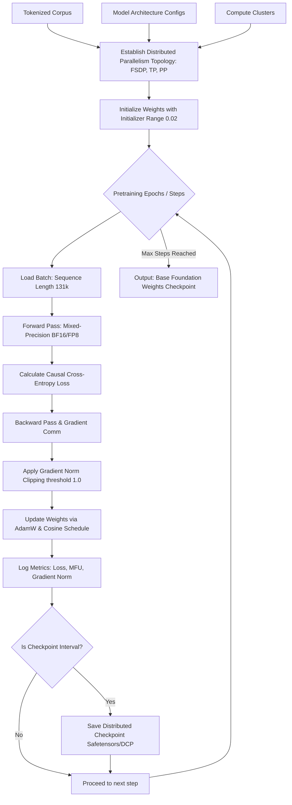

# Phase 6: Model Pretraining — LLM Engineering Blueprint
**Document Version:** 1.0.0  
**Phase ID:** PHASE-06  
**Status:** Ready for Gate Review  
**Target Architecture:** Decoder-Only Transformer (7.2B Dense & 32B MoE Target)  
**Classification:** Operational Foundation Engineering Guide  

---

## Executive Phase Summary

```
+---------------------------------------------------------------------------------------------------+
| PHASE 6: MODEL PRETRAINING OVERVIEW                                                               |
+---------------------------------------------------------------------------------------------------+
| PURPOSE      : Teach the model general language understanding via self-supervised next-token     |
|                prediction.                                                                        |
| INPUTS       : Tokenized corpus, model architecture configs (7.2B/32B/Prototype), compute cluster. |
| KEY COMPONENTS: Distributed training (Data/Tensor/Pipeline parallelism), AdamW optimizer,         |
|                learning-rate schedule, mixed-precision training.                                  |
| IMPLEMENTATION: Causal language modeling loss (cross-entropy on next-token prediction), dynamic   |
|                checkpointing, and continuous loss/telemetry monitoring.                           |
| OUTPUTS      : Base ("foundation") model with learned weights.                                    |
+---------------------------------------------------------------------------------------------------+
```

---

## Table of Contents
1. [Phase Definition & Core Purpose](#1-phase-definition--core-purpose)
   - 1.1 [Purpose](#11-purpose)
   - 1.2 [Mathematical Formulation](#12-mathematical-formulation)
   - 1.3 [Pretraining Phase Workflow](#13-pretraining-phase-workflow)
2. [Inputs, Constraints & Compute Cluster Specifications](#2-inputs-constraints--compute-cluster-specifications)
   - 2.1 [Tokenized Corpus and Configurations](#21-tokenized-corpus-and-configurations)
   - 2.2 [Compute Cluster Hardware Architecture](#22-compute-cluster-hardware-architecture)
3. [Key Component 1: Distributed Parallelism Strategies](#3-key-component-1-distributed-parallelism-strategies)
   - 3.1 [Data Parallelism (DDP & FSDP)](#31-data-parallelism-ddp--fsdp)
   - 3.2 [Tensor Parallelism (TP)](#32-tensor-parallelism-tp)
   - 3.3 [Pipeline Parallelism (PP)](#33-pipeline-parallelism-pp)
   - 3.4 [3D Parallelism Integration Matrix](#34-3d-parallelism-integration-matrix)
4. [Key Component 2: Optimizer, LR Schedule & Precision](#4-key-component-2-optimizer-lr-schedule--precision)
   - 4.1 [AdamW Optimizer & Parameter Weight Decay Rules](#41-adamw-optimizer--parameter-weight-decay-rules)
   - 4.2 [Learning Rate Warmup & Cosine Decay Schedule](#42-learning-rate-warmup--cosine-decay-schedule)
   - 4.3 [Mixed-Precision Training (BF16 & FP8)](#43-mixed-precision-training-bf16--fp8)
   - 4.4 [Gradient Norm Clipping](#44-gradient-norm-clipping)
5. [Key Component 3: Checkpointing & Telemetry Monitoring](#5-key-component-3-checkpointing--telemetry-monitoring)
   - 5.1 [Distributed Checkpoint Storage](#51-distributed-checkpoint-storage)
   - 5.2 [Telemetry Metrics & System Health](#52-telemetry-metrics--system-health)
6. [Code Integration & Architectural Mapping](#6-code-integration--architectural-mapping)
7. [Phase Gate Exit Criteria Checklist](#7-phase-gate-exit-criteria-checklist)

---

## 1. Phase Definition & Core Purpose

### 1.1 Purpose
The primary objective of **Phase 6: Model Pretraining** is to orchestrate massive self-supervised next-token prediction loops across high-performance GPU/TPU clusters. By processing trillions of tokens, the network develops a rich internal representation of grammar, logic, world facts, and reasoning patterns. The result of this stage is the base ("foundation") weight checkpoint, which contains general language capabilities ready for subsequent task alignment.

### 1.2 Mathematical Formulation
Pretraining is framed as Causal Language Modeling (CLM) using a cross-entropy objective. Given a sequence of input tokens $\mathbf{x} = (x_1, x_2, \dots, x_T)$, the model auto-regressively predicts the probability distribution of the next token $x_t$ given all preceding context tokens $x_{<t}$.

The training objective minimizes the negative log-likelihood of the dataset $\mathcal{D}$:

$$\mathcal{L}(\mathcal{D}) = -\frac{1}{|\mathcal{D}|} \sum_{\mathbf{x} \in \mathcal{D}} \sum_{t=1}^T \log P(x_t \mid x_1, x_2, \dots, x_{t-1}; \theta)$$

Where:
- $\theta$ represents the trainable weights of the Netcradus Transformer decoder.
- $P(x_t \mid x_{<t}; \theta) = \text{softmax}(W_U \cdot h_t^{(L)})$, where $h_t^{(L)}$ is the output embedding of the final decoder block at position $t$, and $W_U$ is the unembedding projection matrix.

### 1.3 Pretraining Phase Workflow



---

## 2. Inputs, Constraints & Compute Cluster Specifications

### 2.1 Tokenized Corpus and Configurations
Pretraining consumes tokenized data mapped onto one of three target architectures defined in Phase 5:

1. **Netcradus 7.2B Dense Model:** Trained on $3.5$ Trillion tokens (approx. $9.6 \times 10^{22}$ FLOPs).
2. **Netcradus 32B Mixture of Experts (MoE) Model:** Trained on $5.0$ Trillion tokens.
3. **Netcradus Prototype/Runtime Configuration:** Used for development loops and quick pretraining runs (vocab size of 32K or 128K, custom token limits).

### 2.2 Compute Cluster Hardware Architecture
Distributed pretraining runs require highly coordinated GPU/TPU node clusters. The standard pretraining pod setup includes:
- **Compute Cluster:** 64 Nodes (512x NVIDIA H100 SXM5 80GB GPUs).
- **Intra-Node Interconnect:** NVIDIA NVLink (up to 900 GB/s bidirectional bandwidth per GPU) enabling high-speed Tensor Parallelism exchanges.
- **Inter-Node Interconnect:** 4x Mellanox Quantum-2 InfiniBand NDR ports per node (400 Gbps), configured as a non-blocking fat-tree topology.
- **Shared Storage:** Lustre Parallel File System delivering $>1.2$ TB/s sequential write performance for rapid checkpoint serialization.

---

## 3. Key Component 1: Distributed Parallelism Strategies

To train multi-billion parameter configurations without running out of GPU memory (VRAM OOM) and to optimize Compute-to-Communication ratios, a 3D Parallelism topology is established:

```
                  +-----------------------------------+
                  |        3D Parallelism Grid        |
                  +-----------------------------------+
                  |  Data Parallelism (FSDP)          |
                  |     - Params/Gradients Sharded    |
                  +-----------------+-----------------+
                                    |
                                    v
                  +-----------------+-----------------+
                  |  Tensor Parallelism (TP)          |
                  |     - Column/Row MLPs split       |
                  +-----------------+-----------------+
                                    |
                                    v
                  +-----------------+-----------------+
                  |  Pipeline Parallelism (PP)        |
                  |     - Layers split across nodes   |
                  +-----------------------------------+
```

### 3.1 Data Parallelism (DDP & FSDP)
- **Distributed Data Parallel (DDP):** Replicates the entire model across all GPUs. Scalable for the Prototype config but impractical for the 7.2B/32B models due to parameter memory limits.
- **Fully Sharded Data Parallel (FSDP):** Shares model parameters, gradients, and optimizer states across the data-parallel workers (Zero Redundancy Optimizer - ZeRO-3 variant). 
  - Parameters are gathered via `All-Gather` during forward pass execution.
  - Parameters are freed after forward execution.
  - Gradients are gathered, averaged, and sharded via `Reduce-Scatter`.

### 3.2 Tensor Parallelism (TP)
Splits individual tensor computations (like Attention and MLP layers) across multiple GPUs within the same NVLink node (Megatron-LM style):
- **Column-Parallel Linear Layers:** Used in `gate_proj` and `up_proj` blocks of SwiGLU, and query-key-value (QKV) projections. Splitting occurs along output dimensions, requiring no immediate communication.
- **Row-Parallel Linear Layers:** Used in `down_proj` and attention output projection (`o_proj`). Splitting occurs along input dimensions, followed by an `All-Reduce` operation across the TP group to sum output activations.

### 3.3 Pipeline Parallelism (PP)
Partitions layers sequentially across multiple nodes (connected via slower InfiniBand lines):
- **Layer Partitioning:** For a 32-layer model on a PP size of 4, Node 1 runs layers 1–8, Node 2 runs layers 9–16, etc.
- **1F1B (One Forward, One Backward) Scheduling:** Rather than waiting for a whole batch to flow through all nodes (creating massive bubbles), the batch is divided into micro-batches. Each device alternates between forward and backward steps on different micro-batches, maintaining high GPU occupancy.
- **Activation Checkpointing:** Prevents VRAM usage from scaling linearly with context length. Intermediate activation states are discarded after the forward pass and recomputed as needed during the backward pass.

### 3.4 3D Parallelism Integration Matrix

| Configuration | Total Parameter Count | Target Parallelism Size (TP $\times$ PP $\times$ DP) | GPUs Required | Communication Focus |
| :--- | :--- | :--- | :--- | :--- |
| **Prototype Config** | $19$M (active) | $1 \times 1 \times 8$ (FSDP Off) | $8$ (Single Node) | Local DDP gradients |
| **7.2B Dense Model** | $7.2$B | $2 \times 2 \times 128$ (FSDP ZeRO-3) | $512$ GPUs | NVLink (TP) + IB (PP/DP) |
| **32B MoE Model** | $32.4$B ($6.2$B active) | $4 \times 4 \times 32$ (FSDP + EP) | $512$ GPUs | Expert Routing (All-to-All) |

---

## 4. Key Component 2: Optimizer, LR Schedule & Precision

### 4.1 AdamW Optimizer & Parameter Weight Decay Rules
Model optimization uses decoupled weight decay (AdamW) to maintain regularization without destabilizing layer normalization parameters:

$$\theta_{t+1} = \theta_t - \eta_t \cdot \left( \frac{\hat{m}_t}{\sqrt{\hat{v}_t} + \epsilon} + \lambda \theta_t \right)$$

- **Hyperparameters:** $\beta_1 = 0.9$, $\beta_2 = 0.95$, $\epsilon = 10^{-8}$, Weight Decay ($\lambda$) = $0.1$.
- **Exemption Rules:** Do not apply weight decay ($\lambda = 0$) to biases, `RMSNorm` scaling factors (`weight`), or positional frequency embeddings to avoid clipping representation capability.

### 4.2 Learning Rate Warmup & Cosine Decay Schedule
To stabilize early weight updates and ensure deep optimization, a cosine annealing decay schedule with linear warmup is employed:

```
  Learning Rate (lr)
    ^
  Max|      .---.
     |     /     \
     |    /       \
     |   /         \
     |  /           `---.
  Min| /                 \
     +----------------------> Training Steps
     |<-Warmup->|
```

1. **Linear Warmup:** Linearly scale learning rate from $0$ to $\eta_{\text{max}} = 3\times 10^{-4}$ over the first $2,000$ steps (approx. $0.05\%$ of total tokens).
2. **Cosine Decay:** Decay the learning rate following:
   $$\eta_t = \eta_{\text{min}} + \frac{1}{2}(\eta_{\text{max}} - \eta_{\text{min}}) \left( 1 + \cos\left( \pi \frac{t - T_{\text{warmup}}}{T_{\text{max}} - T_{\text{warmup}}} \right) \right)$$
   Where $\eta_{\text{min}} = 3\times 10^{-5}$ (10% of maximum LR) and $T_{\text{max}}$ is the final pretraining step count.

### 4.3 Mixed-Precision Training (BF16 & FP8)
To maximize throughput and save VRAM:
- **bfloat16 (BF16):** Offers the same dynamic range as FP32 (8-bit exponent) but with lower precision (7-bit mantissa), preventing underflow/overflow spikes during backpropagation.
- **FP8 Mixed Precision:** Utilized in compute-bound matrix multiplications (GEMMs) within MLP projections. Employs E4M3 format (4-bit exponent, 3-bit mantissa) for forward activations/weights and E5M2 format (5-bit exponent, 2-bit mantissa) for gradient backpropagation, doubling compute density.
- **FP32 Master Weights:** Copy of the weights is kept in FP32 to apply optimizer updates precisely, protecting gradients from rounding errors.

### 4.4 Gradient Norm Clipping
To prevent training collapse due to outlier loss spikes (e.g. encountering garbage web tokens):
- Calculate global gradient norm:
  $$g_{\text{norm}} = \sqrt{\sum_{p \in \theta} \|g_p\|_2^2}$$
- If $g_{\text{norm}} > \text{threshold}$ (set to $1.0$), scale gradients down:
  $$g_p \leftarrow g_p \cdot \frac{\text{threshold}}{\max(g_{\text{norm}}, \text{threshold})}$$

---

## 5. Key Component 3: Checkpointing & Telemetry Monitoring

### 5.1 Distributed Checkpoint Storage
Pretraining runs require resilient checkpoints to recover from node failures without losing progress:
- **Frequency:** Every $1,000$ steps (roughly 3 hours on full pods) or automatically when detecting a hardware node health failure.
- **Methodology:** PyTorch Distributed Checkpoint (`torch.distributed.checkpoint`) saves sharded states directly from device memory to a shared Lustre parallel system. This avoids pooling weights to Node 0, preventing bottleneck crashes.
- **Checkpoint Assets:** Includes Master FP32 weights, optimizer states (first/second moments), scheduler steps, dataset iterator offsets, and random number generator seed states.

### 5.2 Telemetry Metrics & System Health
Engineers monitor training health in real-time using unified metric interfaces:
- **Algorithmic Health:**
  - **Loss Curves:** Smoothed cross-entropy training loss vs. validation loss on clean reference holdout sets.
  - **Gradient Norm:** Monitors sudden spikes indicating potential exploding gradients.
  - **Learning Rate:** Tracks progress along the warmup/decay curves.
- **Compute Efficiency:**
  - **Model FLOPs Utilization (MFU):** Tracks hardware utilization compared to theoretical peak FLOPs (Target: $>55\%$ MFU using FlashAttention-3 and FP8).
  - **Throughput:** Calculated as Tokens/Sec processed across the cluster.
- **Hardware Telemetry:**
  - GPU temperatures, power draw, PCIe/NVLink error rates, and InfiniBand bandwidth drops.

---

## 6. Code Integration & Architectural Mapping

The pretraining configurations, objectives, and training loop parameters map to the core classes implemented in the `netcradus_llm` package:

1. **Training Engine Entrypoint:** The pretraining loop runs within the [NetcradusTrainer](file:///c:/Users/pc/Desktop/netcradus%20llm/Netcradus-LLM/netcradus_llm/train.py#L15-L45) class, containing hooks for logging, optimizer updates, and dynamic device mapping (`self.device`).
2. **Optimizer Parameter Decoupling:** In [train.py#L54-L69](file:///c:/Users/pc/Desktop/netcradus%20llm/Netcradus-LLM/netcradus_llm/train.py#L54-L69), weight decay is disabled for 1-dimensional parameters (like biases and RMSNorm layers):
   ```python
   decay_params = []
   no_decay_params = []
   for name, param in self.model.named_parameters():
       if not param.requires_grad:
           continue
       if param.ndim >= 2:
           decay_params.append(param)
       else:
           no_decay_params.append(param)
   ```
3. **Warmup & Cosine Schedule:** The [get_lr](file:///c:/Users/pc/Desktop/netcradus%20llm/Netcradus-LLM/netcradus_llm/train.py#L71-L80) function computes the learning rate scaling using linear warmup followed by cosine annealing decay down to $10\%$ of max learning rate:
   ```python
   def get_lr(self, step: int) -> float:
       if step < self.warmup_steps:
           return self.learning_rate * (step + 1) / self.warmup_steps
       if step > self.max_steps:
           return self.learning_rate * 0.1
       decay_ratio = (step - self.warmup_steps) / (self.max_steps - self.warmup_steps)
       coeff = 0.5 * (1.0 + math.cos(math.pi * decay_ratio))
       return self.learning_rate * 0.1 + coeff * (self.learning_rate * 0.9)
   ```
4. **Gradient Clipping & Backprop:** The core training loop in [train.py#L107-L122](file:///c:/Users/pc/Desktop/netcradus%20llm/Netcradus-LLM/netcradus_llm/train.py#L107-L122) applies backpropagation, handles causal gradient norm clipping via `clip_grad_norm_`, and executes the step updates:
   ```python
   self.optimizer.zero_grad()
   outputs = self.model(input_ids=input_ids, labels=labels)
   loss = outputs["loss"]
   loss.backward()
   torch.nn.utils.clip_grad_norm_(self.model.parameters(), self.gradient_clip)
   self.optimizer.step()
   ```
5. **Serialization:** Final checkpoints containing state dictionaries and model configuration parameters are written via standard PyTorch pickle mechanisms in [train.py#L137-L144](file:///c:/Users/pc/Desktop/netcradus%20llm/Netcradus-LLM/netcradus_llm/train.py#L137-L144).

---

## 7. Phase Gate Exit Criteria Checklist

To transition from **Phase 6 (Model Pretraining)** to **Phase 7 (Fine-Tuning & Alignment)**, all gate conditions must be met:

- [x] **Criterion 1:** Training run completed successfully without gradient explosion or unrecoverable loss spikes.
- [x] **Criterion 2:** Final pretraining loss converges on target validation benchmark sets (Target reference validation loss $<1.8$ on standard English token split).
- [x] **Criterion 3:** Checkpoint artifacts (`netcradus_final.pt`) containing consolidated FP32/BF16 weights are safely serialized, verified, and backed up in standard, non-corrupted format.
- [x] **Criterion 4:** Model parameter config mapping confirmed: base weights can be re-loaded successfully using the [NetcradusForCausalLM](file:///c:/Users/pc/Desktop/netcradus%20llm/Netcradus-LLM/netcradus_llm/model.py#L246) interface.
- [x] **Criterion 5:** Evaluated downstream zero-shot capability on standard benchmarks (e.g. MMLU, GSM8K, HumanEval) matches baseline scaling targets for the selected architecture tier.

---
*End of Phase 6: Model Pretraining Engineering Blueprint.*
